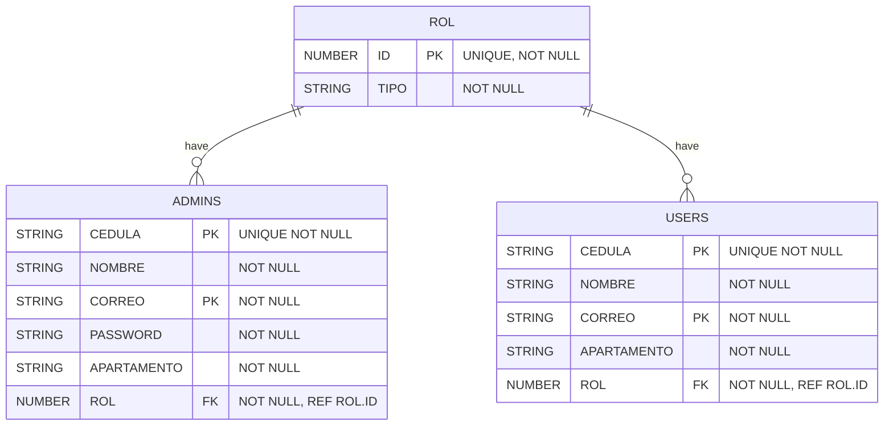

## Database documentation (Postgres)

```mermaid
erDiagram
    ROL ||--o{ ADMINS: have
    ROL ||--o{ USERS: have
    ADMINS {
        STRING CEDULA PK "UNIQUE NOT NULL"
        STRING NOMBRE "NOT NULL"
        STRING CORREO PK "NOT NULL"
        STRING PASSWORD "NOT NULL"
        STRING APARTAMENTO "NOT NULL"
        NUMBER ROL FK "NOT NULL, REF ROL.ID"
    }

    USERS {
        STRING CEDULA PK "UNIQUE NOT NULL"
        STRING NOMBRE "NOT NULL"
        STRING CORREO PK "NOT NULL"
        STRING APARTAMENTO "NOT NULL"
        NUMBER ROL FK "NOT NULL, REF ROL.ID"
    }

    ROL {
        NUMBER ID PK "UNIQUE, NOT NULL"
        STRING TIPO "NOT NULL"
    }

```
