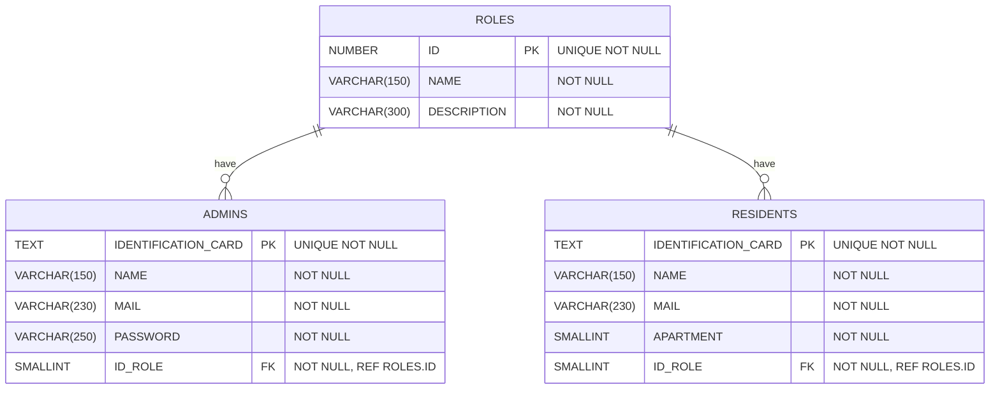

## Database documentation (Postgres)

```mermaid
erDiagram
    ROLES ||--o{ ADMINS: have
    ROLES ||--o{ RESIDENTS: have
    ADMINS {
        TEXT IDENTIFICATION_CARD PK "UNIQUE NOT NULL"
        VARCHAR(150) NAME "NOT NULL"
        VARCHAR(230) MAIL "NOT NULL"
        VARCHAR(250) PASSWORD "NOT NULL"
        SMALLINT ID_ROLE FK "NOT NULL, REF ROLES.ID"
    }

    RESIDENTS {
        TEXT IDENTIFICATION_CARD PK "UNIQUE NOT NULL"
        VARCHAR(150) NAME "NOT NULL"
        VARCHAR(230) MAIL "NOT NULL"
        SMALLINT APARTMENT "NOT NULL"
        SMALLINT ID_ROLE FK "NOT NULL, REF ROLES.ID"
    }

    ROLES {
        NUMBER ID PK "UNIQUE NOT NULL"
        VARCHAR(150) NAME "NOT NULL"
        VARCHAR(300) DESCRIPTION "NOT NULL"
    }

```
